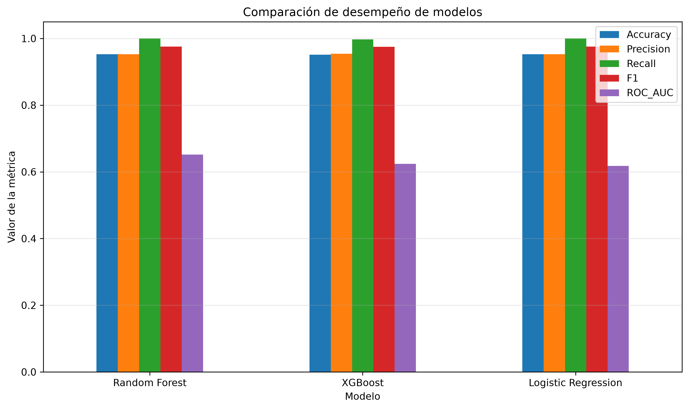
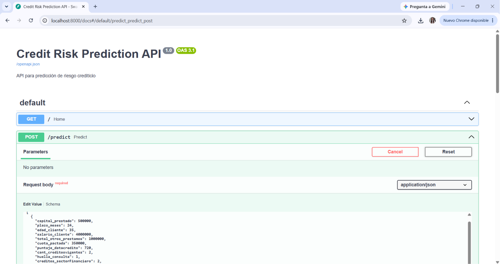
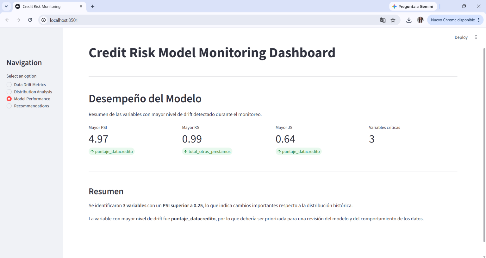
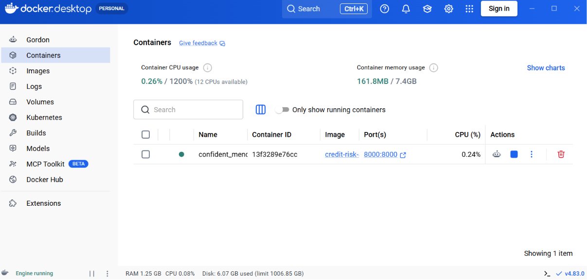

# Predicción de Riesgo Crediticio - Pipeline MLOps (M5)

## Descripción del proyecto

Este proyecto desarrolla una solución de Machine Learning para la predicción del riesgo crediticio de nuevos clientes a partir de información histórica de solicitudes de crédito. La solución implementa un pipeline completo de MLOps que incluye:

- Procesamiento y preparación de los datos.
- Entrenamiento y evaluación de modelos predictivos.
- Despliegue del mejor modelo mediante una API desarrollada con FastAPI.
- Dashboard de monitoreo construido con Streamlit
- contenerización de la aplicación utilizando Docker.


## Objetivo del proyecto

Desarrollar un pipeline de MLOps para la predicción del riesgo crediticio, utilizando técnicas de aprendizaje automático sobre información histórica de clientes. 
El proyecto contempla las etapas de preparación de datos, entrenamiento y evaluación de modelos, despliegue mediante una API, monitoreo del modelo y contenerización con Docker, garantizando la reproducibilidad, trazabilidad y escalabilidad de la solución.

## Tecnologías utilizadas

| Tecnología | Descripción |
|------------|-------------|
| Python 3.11 | Lenguaje principal del proyecto. |
| Pandas | Manipulación y análisis de datos. |
| NumPy | Operaciones numéricas. |
| Scikit-learn | Preprocesamiento y métricas de evaluación. |
| XGBoost | Modelo de Machine Learning para la predicción del riesgo crediticio. |
| FastAPI | Despliegue del modelo mediante una API. |
| Streamlit | Dashboard para el monitoreo del modelo. |
| Docker | Contenerización de la aplicación. |
| Joblib | Serialización del modelo entrenado y del preprocesador. |
| Git & GitHub | Control de versiones del proyecto. |
| Jupyter Notebook | Desarrollo y análisis exploratorio. |

## Estructura base del proyecto

```text
credit-risk-mlops/
│
├── images/
│   ├── dashboard_streamlit.png
│   ├── docker_container.png
│   ├── model_comparison.png
│   ├── swagger_api.png
│   │
├── mlops_pipeline/
│   ├── src/
│   │   ├── cargar_datos.ipynb
│   │   ├── comprension_eda.ipynb
│   │   ├── ft_engineering.py
│   │   ├── model_training_evaluation.py
│   │   ├── model_deploy.py
│   │   ├── model_monitoring.py
│   │   └── streamlit_app.py
│   │
│   ├── base_de_datos.xlsx
│   ├── base_de_datos_simulada.xlsx
│   ├── best_model_v1.1.0.joblib
│   ├── preprocessor_v1.1.0.joblib
│   └── requirements.txt
│
├── Dockerfile
├── requirements.txt
├── requirements_docker.txt
├── .dockerignore
├── .gitignore
└── README.md
```

## Flujo del pipeline

El proyecto sigue un flujo de trabajo basado en las etapas desarrolladas durante el bootcamp de Data Science y MLOps:

1. **Carga de datos:** Importación del conjunto de datos desde archivos Excel.
2. **EDA:** Exploración y análisis de la información para comprender la calidad de los datos y la variable objetivo.
3. **Feature Engineering:** Limpieza, transformación y preparación de las variables para el entrenamiento.
4. **Entrenamiento y evaluación:** Comparación de diferentes modelos de Machine Learning y selección del mejor desempeño.
5. **Despliegue:** Serialización del modelo y publicación mediante una API REST desarrollada con FastAPI.
6. **Monitoreo:** Visualización de indicadores y resultados a través de un dashboard en Streamlit.
7. **Contenerización:** Empaquetado de la aplicación utilizando Docker para facilitar su portabilidad y despliegue.

# Entrenamiento del modelo

## 1. Proceso

El entrenamiento del modelo se realizó utilizando técnicas de aprendizaje supervisado para predecir el riesgo crediticio de nuevos clientes.

El flujo de entrenamiento incluye:

- Preparación y limpieza de los datos.
- Separación de variables predictoras y variable objetivo.
- División del dataset en conjuntos de entrenamiento y prueba.
- Aplicación de transformaciones.
- Entrenamiento y comparación.
- Evaluación mediante métricas de clasificación.
- Selección y serialización del mejor modelo.

## 2. Modelos Evaluados

| Modelo | Descripción |
|--------|-------------|
| Logistic Regression | Modelo base de clasificación. |
| Random Forest | Modelo seleccionado y basado en múltiples árboles de decisión. |
| XGBoost | Modelo basado en rendimiento predictivo. |

## 3. Métricas de Evaluación

Los modelos fueron evaluados utilizando métricas de clasificación:

- Accuracy
- Precision
- Recall
- F1-Score
- ROC-AUC

El modelo con mejor desempeño fue seleccionado y almacenado como:

`best_model_v1.1.0.joblib`

junto con el preprocesador:

`preprocessor_v1.1.0.joblib`

## Comparación de modelos

Durante el entrenamiento se evaluaron diferentes algoritmos de clasificación utilizando métricas como Accuracy, Precision, Recall, F1-Score y ROC-AUC. A partir de estos resultados se seleccionó el modelo con mejor desempeño para su despliegue. (Random Forest)



## Modelo seleccionado

Después de evaluar los diferentes algoritmos de clasificación, el modelo con mejor desempeño fue **Random Forest**, el cual fue seleccionado para el despliegue en producción.


# Despliegue del modelo

## Despliegue mediante API

Una vez seleccionado el mejor modelo durante la etapa de entrenamiento, se implementó un servicio REST utilizando **FastAPI** para disponibilizar el modelo y permitir realizar predicciones sobre nuevos clientes.

El archivo `model_deploy.py` es el encargado de:

- Cargar el modelo entrenado (`best_model_v1.1.0.joblib`).
- Cargar el pipeline de preprocesamiento (`preprocessor_v1.1.0.joblib`).
- Validar los datos recibidos 
- Aplicar las transformaciones necesarias antes de la predicción.
- Ejecutar el modelo de Machine Learning.
- Retornar las predicciones

Esta implementación garantiza que el flujo de predicción en producción sea consistente con el proceso utilizado durante el entrenamiento del modelo.

## Endpoint disponible

| Método | Endpoint | Descripción |
|---------|----------|-------------|
| POST | `/predict` | Genera la predicción del riesgo crediticio.|

## Entrada esperada

El endpoint recibe una lista de clientes en formato JSON con las variables utilizadas durante el entrenamiento del modelo.

Ejemplo:

```json
[
  {
    "capital_prestado": 500000,
    "plazo_meses": 24,
    "edad_cliente": 35,
    "salario_cliente": 4000000,
    "total_otros_prestamos": 1000000,
    "cuota_pactada": 350000,
    "puntaje_datacredito": 720,
    "cant_creditosvigentes": 2,
    "huella_consulta": 1,
    "creditos_sectorFinanciero": 2,
    "creditos_sectorCooperativo": 0,
    "creditos_sectorReal": 0,
    "promedio_ingresos_datacredito": 4000000,
    "tipo_credito": "Consumo",
    "tipo_laboral": "Empleado",
    "tendencia_ingresos": "Estable"
  }
]
``` 
## Respuesta del servicio

La API retorna las predicciones generadas por el modelo en formato JSON.

```json
{
  "predicciones": [
    1
  ]
}
```
## Documentación interactiva

FastAPI genera automáticamente una interfaz Swagger UI, la cual facilita la consulta y prueba de los endpoints disponibles durante el desarrollo.



# Monitoreo del modelo

El monitoreo del modelo está compuesto por dos módulos:

- **model_monitoring.py:** implementa la lógica para calcular métricas de Data Drift y desempeño del modelo.
- **streamlit_app.py:** proporciona una interfaz interactiva desarrollada con Streamlit para visualizar dichas métricas.

## Dashboard de monitoreo 

Como complemento al despliegue del modelo, se desarrolló un dashboard interactivo, con el propósito de visualizar el comportamiento del modelo y facilitar el seguimiento de indicadores durante el proceso de evaluación.

Los archivos `model_monitoring.py` / `streamlit_app.py` permiten:

- Cargar el modelo entrenado y el preprocesador.
- Visualizar información relevante del modelo.
- Ejecutar predicciones desde una interfaz gráfica.
- Mostrar métricas e indicadores de desempeño.
- Facilitar la interpretación de los resultados obtenidos.

El dashboard proporciona una interfaz sencilla e intuitiva que permite interactuar con el modelo sin necesidad de realizar solicitudes directamente a la API.

## Ejecución del dashboard

El dashboard puede iniciarse mediante el siguiente comando:

```bash
streamlit run mlops_pipeline/src/streamlit_app.py
```
## Interfaz del dashboard

El dashboard desarrollado en Streamlit permite visualizar la información del modelo y realizar predicciones de manera interactiva.




# Contenerización con Docker

## Dockerización del proyecto

Con el objetivo de garantizar la portabilidad y facilitar el despliegue de la aplicación, el proyecto fue contenerizado utilizando **Docker**.

Se construyó una imagen que incluye:

- El código fuente del proyecto.
- Las dependencias necesarias para ejecutar la aplicación.
- El modelo entrenado y el pipeline de preprocesamiento.
- La configuración necesaria para exponer la API mediante FastAPI y Uvicorn.

Para optimizar el proceso de construcción se creó un archivo independiente de dependencias (`requirements_docker.txt`), el cual contiene únicamente las librerías necesarias para ejecutar la aplicación en producción.

## Dockerfile

El archivo `Dockerfile` define la imagen de ejecución del proyecto utilizando como base `python:3.11-slim`.


## Construcción de la imagen

La imagen Docker puede construirse mediante el siguiente comando:

```bash
docker build --no-cache -t credit-risk-api .
```
## Ejecución del contenedor

Una vez construida la imagen, el contenedor puede ejecutarse mediante:

```bash
docker run -p 8000:8000 credit-risk-api
```

Al iniciar correctamente, la API queda disponible en:

```text
http://localhost:8000
```

y su documentación interactiva en:

```text
http://localhost:8000/docs
```
## Contenedor en ejecución

Una vez construida la imagen, la aplicación se ejecuta dentro de un contenedor Docker, exponiendo el puerto **8000**



# Cómo ejecutar el proyecto

## Ejecutar la API

```bash
uvicorn mlops_pipeline.src.model_deploy:app --reload
```

La documentación de la API estará disponible en:

```text
http://localhost:8000/docs
```

## Ejecutar el dashboard

```bash
streamlit run mlops_pipeline/src/model_monitoring.py
```

## Ejecutar mediante Docker

Construir la imagen:

```bash
docker build --no-cache -t credit-risk-api .
```

Ejecutar el contenedor:

```bash
docker run -p 8000:8000 credit-risk-api
```
# Versionamiento

El proyecto fue desarrollado utilizando un esquema de versionamiento incremental, registrando los principales avances durante su construcción.

| Versión | Descripción |
|----------|-------------|
| **v1.0.0** | Desarrollo inicial del pipeline de Machine Learning, incluyendo procesamiento de datos, entrenamiento y evaluación de modelos. |
| **v1.1.0** | Integración del pipeline MLOps, serialización del mejor modelo y del preprocesador mediante Joblib. |
| **v1.1.1** | Despliegue del modelo mediante FastAPI, implementación del dashboard de monitoreo con Streamlit, contenerización con Docker y documentación final del proyecto. |

# Autor

**Jessica Andrea Roncancio Vargas<br>**
Bootcamp HENRY /  Data Science (M5)